# 🏛️ Système de Gestion Municipale - INSI-TECH ERP

[](https://your-app.streamlit.app)
[](https://www.python.org/downloads/)
[](https://opensource.org/licenses/MIT)

## 🎯 Objectif général

Solution **IoT sécurisée** basée sur la technologie **Hashgraph** et des **smart contracts dynamiques**, permettant la **gestion automatisée des stocks** de matières premières à l'aide de **tags RFID**.

### Fonctionnalités principales

- 📡 **Détection automatique** via simulateur RFID
- 📧 **Envoi d'emails** automatisés pour la mise à jour des prix
- 📄 **Génération et publication de contrats** sur Hedera
- 💰 **Paiement automatique** via HBAR
- 📊 **Dashboard temps réel** avec Streamlit
- 🗄️ **Base de données SQLite** pour la persistance

---

## 🚀 Installation

### Prérequis

- Python 3.8 ou supérieur
- Un compte [Hedera Testnet](https://portal.hedera.com/)
- Un compte [HiveMQ Cloud](https://www.hivemq.com/cloud/)
- Un compte Gmail avec [mot de passe d'application](https://support.google.com/accounts/answer/185833)

### Étapes d'installation

```bash
# 1. Cloner le projet
git clone <url-du-repo>
cd Projet-Blockchain-et-IoT-Suivi-intelligent-des-stocks-avec-RFID-et-Hashgraph-master

# 2. Créer un environnement virtuel
python -m venv .venv

# 3. Activer l'environnement
# Windows:
.venv\Scripts\activate
# Linux/Mac:
source .venv/bin/activate

# 4. Installer les dépendances
pip install -r requirements.txt

# 5. Configurer les variables d'environnement
# Copier le fichier exemple
copy .env.example .env
# Puis éditer .env avec vos valeurs
```

### Configuration du fichier .env

```ini
# Email
EMAIL_FROM=votre_email@gmail.com
EMAIL_PASSWORD=votre_mot_de_passe_application
EMAIL_TO=fournisseur@email.com

# MQTT (HiveMQ Cloud)
MQTT_BROKER=votre_broker.hivemq.cloud
MQTT_PORT=8883
MQTT_USERNAME=votre_username
MQTT_PASSWORD=votre_password

# Hedera Hashgraph
OPERATOR_ID=0.0.XXXXXX
OPERATOR_KEY=302e020100300506032b6570...
TOPIC_ID=0.0.XXXXXX
SUPPLIER_ACCOUNT_ID=0.0.XXXXXX
```

---

## 📊 Dashboard

Lancez l'interface graphique pour visualiser vos stocks en temps réel :

```bash
streamlit run dashboard.py
```

Le dashboard affiche :
- 📈 **Niveaux de stock** avec graphiques
- 🚨 **Alertes** de stock critique
- 📄 **Historique des contrats**
- 💰 **Transactions Hedera**
- 🔗 **Liens HashScan** pour vérification blockchain

---

## 🧩 Architecture du Projet

```
├── config.py              # Configuration centralisée (charge .env)
├── logger.py              # Système de logging
├── database.py            # Base de données SQLite
├── dashboard.py           # Interface Streamlit
├── simulateur_rfid.py     # Simulation capteurs RFID
├── detecteur_seuil.py     # Détection stock critique
├── envoi_email.py         # Envoi emails au fournisseur
├── email_reader.py        # Lecture réponse prix
├── contract_manager.py    # Génération contrats
├── hedera_publisher.py    # Publication sur Hedera
├── confirm_reception.py   # Confirmation de réception
├── payment.py             # Paiement HBAR
├── main.py                # Script principal
├── requirements.txt       # Dépendances Python
├── .env.example           # Template configuration
├── .gitignore             # Fichiers ignorés par Git
└── tests/                 # Tests unitaires
    ├── test_database.py
    └── test_contract_manager.py
```

---

## 🔄 Flux de Fonctionnement

```mermaid
graph LR
    A[📡 Capteur RFID] -->|MQTT| B[🔍 Détecteur Seuil]
    B -->|Stock < 20| C[📧 Email Fournisseur]
    C --> D[📖 Lecture Réponse Prix]
    D --> E[📄 Génération Contrat]
    E --> F[⛓️ Publication Hedera]
    F --> G[✅ Confirmation Réception]
    G --> H[💰 Paiement HBAR]
    H --> I[📊 Dashboard]
```



1. **Simulation RFID** → Envoie quantités via MQTT
2. **Détection Seuil** → Si stock < 20, déclenche alerte
3. **Email Fournisseur** → Demande de prix
4. **Lecture Réponse** → Extrait le prix
5. **Contrat** → Génère et publie sur Hedera
6. **Confirmation** → Valide la réception
7. **Paiement** → Transfert HBAR au fournisseur

---

## 🧪 Tests

Exécutez les tests unitaires :

```bash
# Tous les tests
pytest tests/ -v

# Avec couverture
pytest tests/ -v --cov=. --cov-report=html
```

---

## 📖 Modules Principaux

### Simulateur RFID
```bash
python simulateur_rfid.py
```
Publie des données de stock aléatoires toutes les 5 secondes.

### Détecteur de Seuil
```bash
python detecteur_seuil.py
```
Écoute les messages MQTT et déclenche les alertes.

### Script Principal
```bash
python main.py
```
Exécute le flux complet : lecture email → contrat → publication → paiement.

---

## 🔗 Vérification Blockchain

Toutes les transactions sont vérifiables sur [HashScan](https://hashscan.io/testnet) :
- Cherchez par Transaction ID
- Vérifiez les messages publiés sur votre Topic ID

---

## 📁 Base de Données

Le projet utilise SQLite avec les tables :
- `stocks` - Niveaux de stock par matière
- `contrats` - Historique des commandes
- `transactions` - Paiements effectués
- `alertes` - Notifications de stock critique
- `fournisseurs` - Liste des fournisseurs

Initialiser la base :
```bash
python database.py
```

---

## ⚠️ Sécurité

- ✅ Les credentials sont dans `.env` (non versionné)
- ✅ Le fichier `.gitignore` protège les fichiers sensibles
- ✅ Utilisation TLS pour MQTT
- ✅ Logging des opérations dans `logs/`

---

## 🤝 Contribution

1. Fork le projet
2. Créer une branche (`git checkout -b feature/nouvelle-fonctionnalite`)
3. Commit (`git commit -m 'Ajout nouvelle fonctionnalité'`)
4. Push (`git push origin feature/nouvelle-fonctionnalite`)
5. Ouvrir une Pull Request

---

## 📜 Licence

Ce projet est sous licence MIT.

---

## ✅ Conclusion

Ce projet met en œuvre un **système IoT intelligent** pour la gestion des stocks critiques en intégrant des **capteurs simulés**, le **protocole MQTT**, et la **technologie blockchain Hedera Hashgraph**.

Grâce à une architecture automatisée et sécurisée, chaque étape – de la détection à la transaction – est tracée, transparente et exécutable sans intervention humaine directe.
